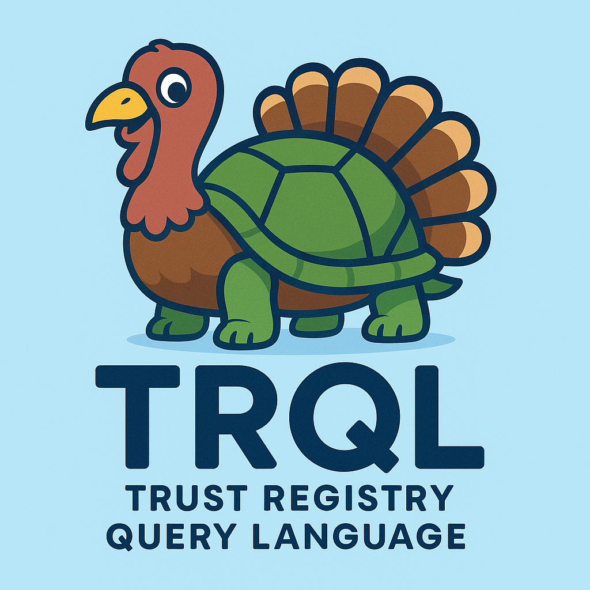

# Trust Registry Query Protocol

This repository contains the specification for the Trust Registry Query Protocol.

  

## Overview

The Trust Registry Query Protocol defines the mechanisms and data formats for querying trust registries in decentralized identity ecosystems. It enables clients to discover, verify, and interact with trust registries to determine the status and roles of various entities.

## Specification

- The protocol specification is provided in this repository.
- This protocol is designed to be interoperable and extensible for various trust registry implementations.

## Contributing

Contributions are welcome! Please see the `Contributing.md` file for guidelines.

## License

This project is licensed under the Apache License 2.0. See the `LICENSE.md` file for details.

---

*This is the specification for the trust registry query protocol.*
