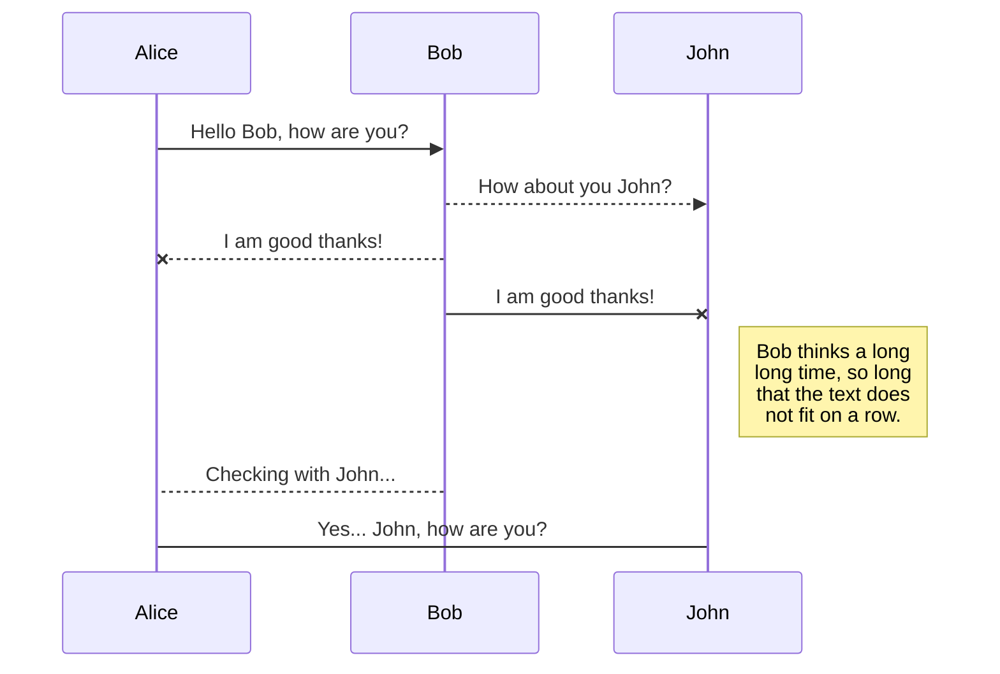
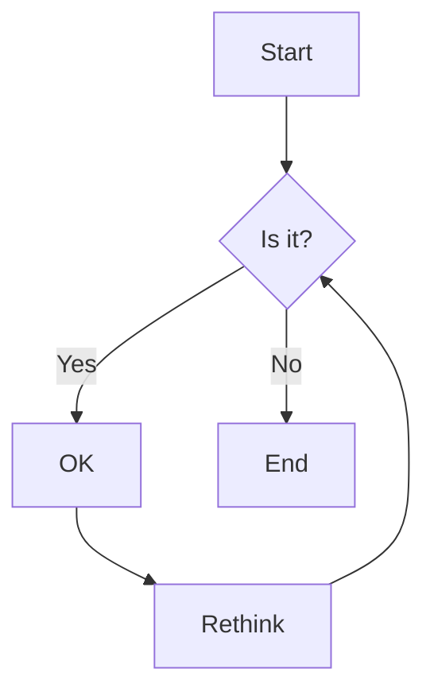

## Demo of example markup in Spec-Up-T and Markdown

### Blockquote

> To be, or not to be, that is the question:
Whether 'tis nobler in the mind to suffer
The slings and arrows of outrageous fortune,
Or to take arms against a sea of troubles
And by opposing end them. To die—to sleep,
No more;

### Notices

<pre>
::: note Basic Note
  Check this out.
:::
</pre>

::: note Basic Note
  Check this out.
:::

::: note
  Here's another.
:::

::: note
  And one more!
:::

::: note Basic Note
  One last note!!!
:::

<pre>
::: issue Issue Notice
  I take issue with that, kind sir.
:::
</pre>

::: issue Issue Notice
  I take issue with that, kind sir.
:::

<pre>
::: warning Warning Notice
  Houston, I think we have a problem
:::
</pre>

::: warning Warning Notice
  Houston, I think we have a problem
:::

<pre>
::: todo Really Important
  Get this done!
:::
</pre>

::: todo Really Important
  Get this done!
:::

<pre>
::: example Code Example
  Put your code block here
:::
</pre>

::: example Code Example

```json
// Some comment in JSON
{
  "foo": "bar",
  "baz": 2
}
```

:::

### Content Insertion

Use the following format to pull in content from other files in your project:

<pre>
This text has been inserted here from another file: &#91;&#91;insert: assets/test.text&#93;&#93;
</pre>

This text has been inserted here from another file: [[insert: assets/test.text]]

You can even insert content within more complex blocks, like the JSON object below which is being pulled in and rendered in a syntax-highlighted example block:
<pre>
::: example Code Example
```json
&#91;&#91;insert: assets/test.json&#93;&#93;
```
:::
</pre>

::: example Code Example

```json
[[insert: assets/test.json]]
```

:::

### Tables

<pre>
|              Stage | Direct Products | ATP Yields |
| -----------------: | --------------: | ---------: |
|         Glycolysis |           2 ATP |            |
|                 ^^ |          2 NADH |   3--5 ATP |
| Pyruvaye oxidation |          2 NADH |      5 ATP |
|  Citric acid cycle |           2 ATP |            |
|                 ^^ |          6 NADH |     15 ATP |
|                 ^^ |         2 FADH2 |      3 ATP |
|     **30--32** ATP |                 |            |
[Net ATP yields per hexose]
</pre>

|              Stage | Direct Products | ATP Yields |
| -----------------: | --------------: | ---------: |
|         Glycolysis |           2 ATP |            |
|                 ^^ |          2 NADH |   3--5 ATP |
| Pyruvaye oxidation |          2 NADH |      5 ATP |
|  Citric acid cycle |           2 ATP |            |
|                 ^^ |          6 NADH |     15 ATP |
|                 ^^ |         2 FADH2 |      3 ATP |
|     **30--32** ATP |                 |            |
[Net ATP yields per hexose]

<pre>
|     |     |     |     |     |     |     |     |
| --- | --- | --- | --- | --- | --- | --- | --- |
| ♜   |     | ♝   | ♛   | ♚   | ♝   | ♞   | ♜   |
|     | ♟   | ♟   | ♟   |     | ♟   | ♟   | ♟   |
| ♟   |     | ♞   |     |     |     |     |     |
|     | ♗   |     |     | ♟   |     |     |     |
|     |     |     |     | ♙   |     |     |     |
|     |     |     |     |     | ♘   |     |     |
| ♙   | ♙   | ♙   | ♙   |     | ♙   | ♙   | ♙   |
| ♖   | ♘   | ♗   | ♕   | ♔   |     |     | ♖   |

</pre>

|     |     |     |     |     |     |     |     |
| --- | --- | --- | --- | --- | --- | --- | --- |
| ♜   |     | ♝   | ♛   | ♚   | ♝   | ♞   | ♜   |
|     | ♟   | ♟   | ♟   |     | ♟   | ♟   | ♟   |
| ♟   |     | ♞   |     |     |     |     |     |
|     | ♗   |     |     | ♟   |     |     |     |
|     |     |     |     | ♙   |     |     |     |
|     |     |     |     |     | ♘   |     |     |
| ♙   | ♙   | ♙   | ♙   |     | ♙   | ♙   | ♙   |
| ♖   | ♘   | ♗   | ♕   | ♔   |     |     | ♖   |


### Sequence Diagrams

<pre>

</pre>


### Flows

<pre>

</pre>


### Charts

<pre>
```js
{
  "type": "pie",
  "data": {
    "labels": [
      "Red",
      "Blue",
      "Yellow"
    ],
    "datasets": [
      {
        "data": [
          300,
          50,
          100
        ],
        "backgroundColor": [
          "#FF6384",
          "#36A2EB",
          "#FFCE56"
        ],
        "hoverBackgroundColor": [
          "#FF6384",
          "#36A2EB",
          "#FFCE56"
        ]
      }
    ]
  }
}
```
</pre>

```js
{
  "type": "pie",
  "data": {
    "labels": [
      "Red",
      "Blue",
      "Yellow"
    ],
    "datasets": [
      {
        "data": [
          300,
          50,
          100
        ],
        "backgroundColor": [
          "#FF6384",
          "#36A2EB",
          "#FFCE56"
        ],
        "hoverBackgroundColor": [
          "#FF6384",
          "#36A2EB",
          "#FFCE56"
        ]
      }
    ]
  }
}
```

### Syntax Highlighting

<pre>
```json
{
  "@context": "https://www.w3.org/ns/did/v1",
  "id": "did:example:123456789abcdefghi",
  "authentication": [{
    "id": "did:example:123456789abcdefghi#keys-1",
    "type": "RsaVerificationKey2018",
    "controller": "did:example:123456789abcdefghi",
    "publicKeyPem": "-----BEGIN PUBLIC KEY...END PUBLIC KEY-----\r\n"
  }],
  "service": [{
    "id":"did:example:123456789abcdefghi#vcs",
    "type": "VerifiableCredentialService",
    "serviceEndpoint": "https://example.com/vc/"
  }]
}
```
</pre>

```json
{
  "@context": "https://www.w3.org/ns/did/v1",
  "id": "did:example:123456789abcdefghi",
  "authentication": [{ 
    "id": "did:example:123456789abcdefghi#keys-1",
    "type": "RsaVerificationKey2018",
    "controller": "did:example:123456789abcdefghi",
    "publicKeyPem": "-----BEGIN PUBLIC KEY...END PUBLIC KEY-----\r\n"
  }],
  "service": [{
    "id":"did:example:123456789abcdefghi#vcs",
    "type": "VerifiableCredentialService",
    "serviceEndpoint": "https://example.com/vc/"
  }]
}
```

### TeX Math Equations

When the `katex` option is enabled, the KaTeX math engine is used for TeX rendering. You can find a list of supported features and examples here: <https://katex.org/docs/supported.html>.

$$\begin{pmatrix}x_2 \\ y_2 \end{pmatrix} =
\begin{pmatrix} A & B \\ C & D \end{pmatrix}\cdot
\begin{pmatrix} x_1 \\ y_1 \end{pmatrix}$$

$$\def\arraystretch{1.5}
   \begin{array}{c:c:c}
   a & b & c \\ \hline
   d & e & f \\
   \hdashline
   g & h & i
\end{array}$$

$$
\underbrace{a+b+c}_{\text{Note: such math, much wow.}}
$$

### Tab Panels

<tab-panels selected-index="0">
  <nav>
    <button type="button">First Tab</button>
    <button type="button">Second Tab</button>
  </nav>

  <section>

```json
{
  "foo": "foo",
  "baz": 1
}
```

  </section>
  <section>

```json
{
  "foo": "bar",
  "baz": 2
}
```

  </section>
</tab-panels>

### Fancy Links

Spec-Up automatically upgrades the links of certain sites, like GitHub. GitHub is the only supported site with Fancy Links right now, but we'll be adding more as we go.

### GitHub

- **Issues**
  - Source: `https://github.com/decentralized-identity/presentation-exchange/issues/119`
  - Render: https://github.com/decentralized-identity/presentation-exchange/issues/119
- **Pull Requests**
  - Source: `https://github.com/decentralized-identity/sidetree/pull/863`
  - Render: https://github.com/decentralized-identity/sidetree/pull/863
- **Releases**
  - Source: `https://github.com/decentralized-identity/sidetree/releases/tag/v0.9.1`
  - Render: https://github.com/decentralized-identity/sidetree/releases/tag/v0.9.1
- **Projects**
  - Source: `https://github.com/decentralized-identity/sidetree/projects/1`
  - Render: https://github.com/decentralized-identity/sidetree/projects/1
